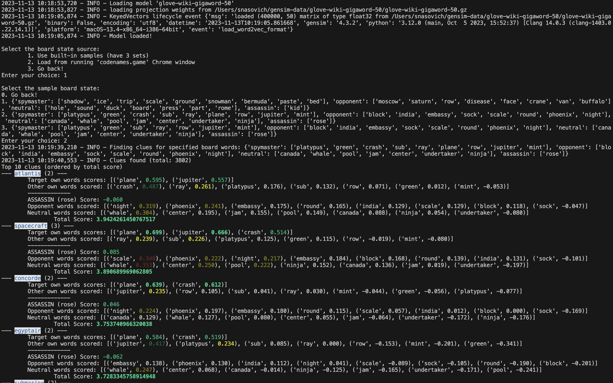

# Codenames Helper

Codenames helper is a tool built to help playing [Codenames](https://en.wikipedia.org/wiki/Codenames_(board_game)) game. Current functionality includes helpers for playing the **Spymaster only**:
1. Loading board state from https://codenames.game/ running in Chrome (it needs to be launched with remote debugging enabled on port 9222, something like `/Applications/Google\ Chrome.app/Contents/MacOS/Google\ Chrome --remote-debugging-port=9222 --new-window codenames.game`)
1. Suggesting clues based on Word2Vec word similarity scores, with scoring model accounting for matches of own, assassing, opponent, and neutral words.

Sample output:

## Running

Run `main.py` after installing packages from `requirements.txt` (venv setup recommended)

## Future functionality

Below are not the commitment but rather the ideas for the next features to be implemented:
1. Enhance UI to allow filtering/sorting of results - current order by scores is not always ideal (e.g. 1-match clues may be at the top of scores so there should be a way to filter out clues with fewer than X matches etc.)
1. Enhance UI to allow paging past 10 top results shown
1. Add support for operative (regular player) mode where it ranks remaining board words based on clue given by spymaster
1. (Rather far-fetched) Implement multiple strategies for picking clues and pitch the versions of program running different strategies against each other to come up and prove the best strategy